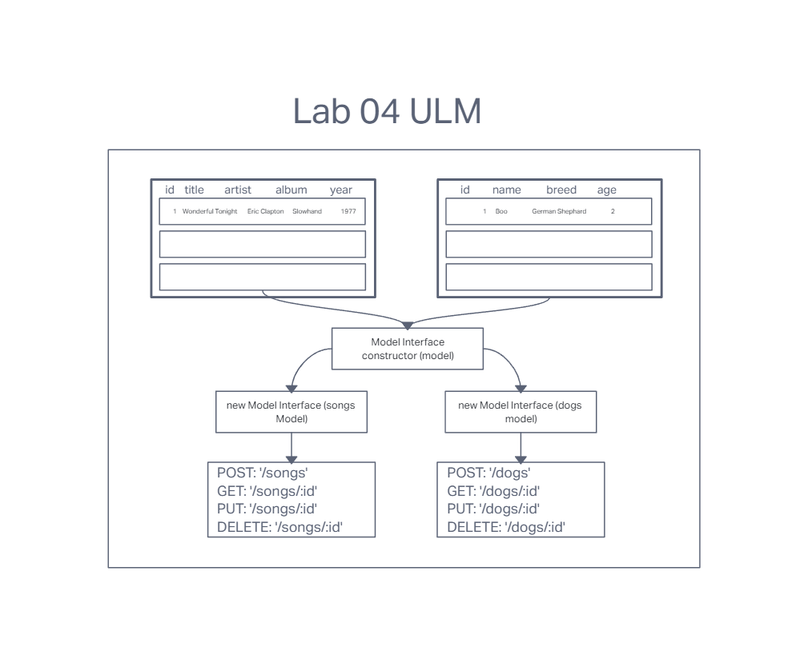

# Project: Basic API Server

## Author: Tyler Main

### Code 401d48 Lab 04

### Problem Domain

Build a REST API using Express, by creating a proper series of endpoints that perform CRUD operations on a Postgres SQL Database, using the REST standard

### Requirements:

#### SQL Models

- Utilize a Collection Interface that incorporates a Sequelize Model and perform database CRUD operations

- Create 2 SQL data models using the Sequelize library, make sure you export those model instances.

- Make sure your Models are configured with your SQL dialect and can properly connect to your database.

- Your models should have appropriate field names declared with specific sequelize DataTypes.

#### Include testing to assert the following

- 404 on a bad route

- 404 on a bad method

- The correct status codes and returned data for each REST route

- Create a record using POST

- Read a list of records using GET

- Read a record using GET

- Update a record using PUT

- Destroy a record using DELETE

### Dependencies

- node
- dotenv
- express
- jest
- supertest
- sequelize
- sequelize-cli
- pg
- sqlite3

### UML

